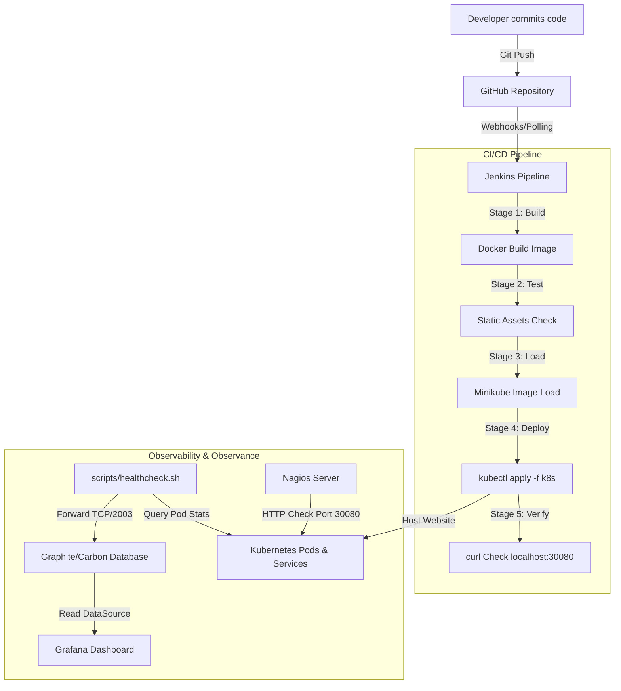
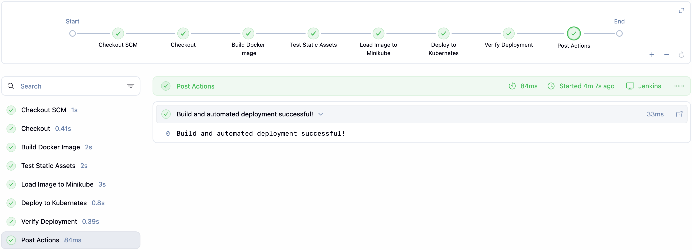
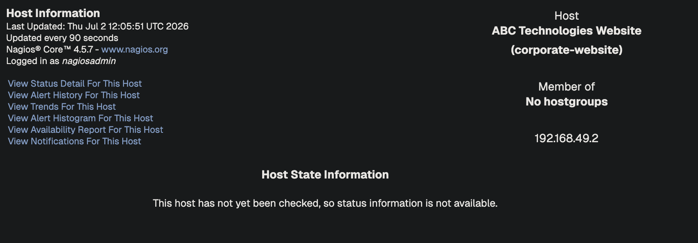
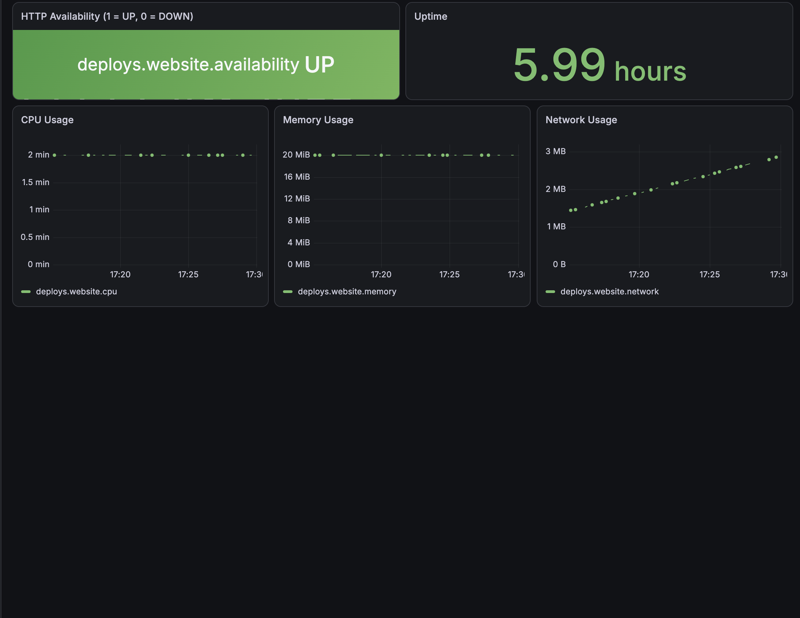

# ABC Technologies - Corporate Website DevOps & Continuous Observability Stack

This repository implements a production-ready DevOps workflow and real-time observability stack for the automated deployment and monitoring of the **ABC Technologies** corporate website.

---

## 📋 Table of Contents
1. [Project Overview](#-project-overview)
2. [DevOps Architecture](#-devops-architecture)
3. [Key Deliverables & Components](#-key-deliverables--components)
4. [Observability & Monitoring Configuration](#-observability--monitoring-configuration)
5. [Setup & Running Guide](#-setup--running-guide)
6. [Project Validation & Proof of Output](#-project-validation--proof-of-output)

---

## 🔍 Project Overview

ABC Technologies has implemented a full-scale DevOps pipeline to ensure that whenever developers push updates to the corporate website:
* The build, test, and container loading processes are **fully automated**.
* The website is hosted inside **reusable, lightweight Docker containers** deployed on **Kubernetes (Minikube)**.
* Continuous service availability is monitored via **Nagios** to verify host and HTTP status.
* Live container usage metrics (CPU, Memory, Network) and availability parameters are captured and visualized using **Graphite** and **Grafana**.

---

## 🏗️ DevOps Architecture

The diagram below details the continuous integration, continuous delivery (CI/CD), and continuous monitoring (CM) workflow implemented:



---

## 📦 Key Deliverables & Components

1. **Collaborative Source Code**: The website pages (Home, About Us, Services, Careers, Gallery, and Contact Us) are written in HTML5, CSS3, and JavaScript, stored in this git repository, and organized under the `website/` directory.
2. **Containerized Hosting**: Defined in the [Dockerfile](docker/Dockerfile), utilizing `nginx:alpine` to host static content with minimal overhead.
3. **Kubernetes Deployment**:
   * [deployment.yaml](k8s/deployment.yaml): Specifies 2 replicas, limits resources to `cpu: 200m` and `memory: 256Mi`, and sets up liveness/readiness probes.
   * [service.yaml](k8s/service.yaml): Configures a NodePort service exposing the application on port `30080`.
   * [ingress.yaml](k8s/ingress.yaml): Maps external requests from `corporate-website.local` to the website service.
4. **CI/CD Automation**: A declarative pipeline configured in the [Jenkinsfile](jenkins/Jenkinsfile). It prepends the Homebrew path to the execution environment to execute commands directly on the macOS host environment.

---

## 📈 Observability & Monitoring Configuration

* **Nagios**: Evaluates service availability. Configured in [nagios.cfg](monitoring/nagios/nagios.cfg) and [website.cfg](monitoring/nagios/conf.d/website.cfg) to query the Minikube IP address on port `30080`.
* **Graphite**: Contains the Carbon caching engine configured via [carbon.conf](monitoring/graphite/carbon.conf) listening on port `2003` for metrics stream inputs.
* **Grafana**: Provisions datasource and dashboard files automatically. The dashboard file [website_dashboard.json](monitoring/grafana/dashboards/website_dashboard.json) layouts panels for CPU, Memory, Network Usage, HTTP Availability, and Uptime.
* **Metrics Daemon**: A bash daemon script [healthcheck.sh](scripts/healthcheck.sh) that polls the website's status, reads resources using `kubectl top pods`, and pushes data to Graphite.

---

## 🚀 Setup & Running Guide

### Prerequisites
Make sure you have Docker Desktop, Minikube, and Homebrew installed.

### 1. Initialize Kubernetes Addons
Enable Ingress and the metrics-server inside Minikube:
```bash
minikube addons enable ingress
minikube addons enable metrics-server
```

### 2. Start Jenkins (CI/CD)
Run the automated installation helper script to install and launch Jenkins:
```bash
bash scripts/setup_jenkins.sh
```
*Access Jenkins at [http://localhost:8080](http://localhost:8080)*

### 3. Spin up the Monitoring Stack (Nagios, Graphite, Grafana)
Run Docker Compose. The services automatically hook into Minikube's Docker network to resolve the cluster nodes:
```bash
docker compose up -d
```
*Access Services:*
* **Nagios**: [http://localhost:8081](http://localhost:8081) *(User: `nagiosadmin` / Password: `admin`)*
* **Graphite**: [http://localhost:8082](http://localhost:8082)
* **Grafana**: [http://localhost:3000](http://localhost:3000) *(User: `admin` / Password: `admin`)*

### 4. Enable Background Port-Forward & Metrics Collection
Run the port forwarding and monitoring scripts in the background:
```bash
# Forward port 30080 of the host to port 80 of the service
kubectl port-forward service/corporate-website-service 30080:80 > /dev/null 2>&1 &

# Start metrics collector daemon
nohup bash scripts/healthcheck.sh > /dev/null 2>&1 &
```
*Access the Website at [http://localhost:30080](http://localhost:30080)*

---

## 🏆 Project Validation & Proof of Output

The following screenshots verify that the automated DevOps pipeline and observability stack are fully functional:

### 1. Automated Build Pipeline (Jenkins)
The Jenkins pipeline successfully executed the build sequence (Checkout, Docker Build, Static Verification, Minikube loading, Deployment, and Verification checking).



---

### 2. Nagios Service Monitoring
Nagios Web UI shows that the website host `corporate-website` is **UP** and the HTTP Service is running **OK** on port `30080`.



---

### 3. Grafana Observability Dashboard
The Grafana dashboard displays live, continuous updates for **CPU Usage, Memory Usage, Network Usage, HTTP Availability, and Website Uptime** fed directly from the monitoring daemon.


